# Click4Cuti — Entity Relationship Diagram

19 entities across 5 domains: Tenancy, Authentication, Organisation, Leave, Operations.

---

## Mermaid ERD

```mermaid
erDiagram
  HR_AGENCIES {
    uuid id PK
    string name
    string email
    string phone
    string address
    boolean is_active
    timestamp created_at
    timestamp updated_at
  }

  COMPANIES {
    uuid id PK
    uuid agency_id FK "nullable - null if independent"
    string name
    string registration_number
    string hr_email
    string address
    string state "e.g. Selangor WP KL - for PH rules"
    boolean is_active
    timestamp created_at
    timestamp updated_at
  }

  DEPARTMENTS {
    uuid id PK
    uuid company_id FK
    string name
    boolean is_active
    timestamp created_at
  }

  DESIGNATIONS {
    uuid id PK
    uuid company_id FK
    string title
    boolean is_manager
    boolean is_active
    timestamp created_at
  }

  ADMIN_USERS {
    uuid id PK
    uuid agency_id FK "nullable - null for superadmin"
    uuid company_id FK "nullable - null for superadmin and agency"
    string full_name
    string email UK
    string phone
    string password_digest "bcrypt via has_secure_password"
    enum scope "SUPER_ADMIN AGENCY COMPANY"
    boolean is_active
    string reset_password_token "nullable"
    timestamp reset_password_sent_at "nullable"
    timestamp last_sign_in_at "nullable"
    string last_sign_in_ip "nullable"
    int sign_in_count
    timestamp created_at
    timestamp updated_at
  }

  ADMIN_SESSIONS {
    uuid id PK
    uuid admin_user_id FK
    string token_digest UK "hashed session token"
    string ip_address
    string user_agent
    timestamp expires_at
    timestamp last_active_at
    timestamp revoked_at "nullable"
    timestamp created_at
  }

  USERS {
    uuid id PK
    uuid company_id FK
    uuid department_id FK
    uuid designation_id FK
    uuid manager_id FK "self-ref nullable"
    string employee_id UK
    string full_name
    string email UK
    string phone
    string address
    string password_digest "bcrypt via has_secure_password"
    enum role "ADMIN MANAGER EMPLOYEE"
    date join_date
    enum gender "MALE FEMALE"
    int number_of_children "for maternity eligibility"
    boolean is_confirmed "probation vs confirmed"
    boolean is_active
    string reset_password_token "nullable"
    timestamp reset_password_sent_at "nullable"
    timestamp last_sign_in_at "nullable"
    string last_sign_in_ip "nullable"
    int sign_in_count
    timestamp created_at
    timestamp updated_at
  }

  USER_SESSIONS {
    uuid id PK
    uuid user_id FK
    string token_digest UK "hashed session token"
    string ip_address
    string user_agent
    timestamp expires_at
    timestamp last_active_at
    timestamp revoked_at "nullable"
    timestamp created_at
  }

  LEAVE_POLICIES {
    uuid id PK
    uuid company_id FK
    string name "e.g. Standard Executive Maternity"
    text description
    int advance_notice_days "default 7"
    boolean is_active
    timestamp created_at
    timestamp updated_at
  }

  LEAVE_TYPES {
    uuid id PK
    uuid leave_policy_id FK
    string name "e.g. Annual Sick Emergency Maternity"
    enum category "MANDATORY SPECIAL"
    int default_days_tier1 "less than 2 years service"
    int default_days_tier2 "2 to 5 years service"
    int default_days_tier3 "more than 5 years service"
    int max_consecutive_days "nullable - default 3 for AL"
    boolean requires_document "true for Medical"
    boolean allows_half_day
    boolean allows_carry_forward
    int max_carry_forward_days "nullable"
    int max_times_per_year "nullable - e.g. 3 for Emergency"
    uuid shared_balance_with FK "nullable - EL shares with AL"
    boolean is_active
    timestamp created_at
  }

  USER_LEAVE_POLICIES {
    uuid id PK
    uuid user_id FK
    uuid leave_policy_id FK
    date effective_from
    date effective_to "nullable"
    timestamp created_at
  }

  LEAVE_BALANCES {
    uuid id PK
    uuid user_id FK
    uuid leave_type_id FK
    int year
    float total_entitled
    float carried_forward
    float used_days
    float pending_days
    float remaining_days
    timestamp updated_at
  }

  LEAVE_APPLICATIONS {
    uuid id PK
    uuid user_id FK
    uuid leave_type_id FK
    uuid approved_by FK "nullable"
    date start_date
    date end_date
    float total_days
    text reason
    text extended_reason "required if exceeds max_consecutive_days"
    enum status "PENDING APPROVED REJECTED CANCELLED"
    text reviewer_remarks "nullable"
    boolean requires_ceo_approval "auto-set if exceeds limit"
    timestamp created_at
    timestamp updated_at
  }

  LEAVE_DAY_DETAILS {
    uuid id PK
    uuid leave_application_id FK
    date leave_date
    enum day_type "FULL_DAY HALF_DAY_AM HALF_DAY_PM"
  }

  LEAVE_DOCUMENTS {
    uuid id PK
    uuid leave_application_id FK
    string file_name
    string file_path
    string content_type
    int file_size
    timestamp created_at
  }

  WARNING_LETTERS {
    uuid id PK
    uuid user_id FK
    uuid company_id FK
    uuid leave_type_id FK "e.g. Emergency Leave"
    string reason "e.g. Exceeded 3 emergency leaves"
    int year
    date issued_date
    boolean acknowledged
    timestamp acknowledged_at "nullable"
    timestamp created_at
  }

  WORK_SCHEDULES {
    uuid id PK
    uuid company_id FK
    string name "e.g. Standard Office Night Shift WFH"
    time start_time
    time end_time
    time break_start
    time break_end
    string rest_days "e.g. Sat Sun"
    boolean is_active
    timestamp created_at
    timestamp updated_at
  }

  USER_WORK_SCHEDULES {
    uuid id PK
    uuid user_id FK
    uuid work_schedule_id FK
    date effective_from
    date effective_to "nullable"
    timestamp created_at
  }

  PUBLIC_HOLIDAYS {
    uuid id PK
    uuid company_id FK
    string name
    date holiday_date
    int year
    boolean is_mandatory "5 mandatory under EA1955"
    boolean is_replacement "replacement if falls on rest day"
    timestamp created_at
  }

  EMAIL_NOTIFICATIONS {
    uuid id PK
    uuid company_id FK "nullable"
    string recipient_email
    string recipient_type "AdminUser or User"
    uuid recipient_id
    string subject
    text body
    string notification_type "LEAVE_APPLIED LEAVE_APPROVED LEAVE_REJECTED WARNING_ISSUED"
    uuid reference_id "nullable - polymorphic"
    string reference_type "nullable"
    enum delivery_status "PENDING SENT FAILED"
    timestamp sent_at "nullable"
    timestamp created_at
  }

  ACTIVITY_LOG {
    uuid id PK
    uuid actor_id "polymorphic - admin_user or user"
    string actor_type "AdminUser or User"
    uuid company_id FK "nullable"
    string action "e.g. SIGN_IN LEAVE_APPLIED USER_CREATED"
    string entity_type "nullable"
    uuid entity_id "nullable"
    text details "nullable"
    string ip_address "nullable"
    timestamp created_at
  }

  HR_AGENCIES ||--o{ COMPANIES : "manages"
  HR_AGENCIES ||--o{ ADMIN_USERS : "has admins"
  COMPANIES ||--o{ DEPARTMENTS : "has"
  COMPANIES ||--o{ DESIGNATIONS : "defines"
  COMPANIES ||--o{ USERS : "employs"
  COMPANIES ||--o{ ADMIN_USERS : "has admins"
  COMPANIES ||--o{ LEAVE_POLICIES : "configures"
  COMPANIES ||--o{ WORK_SCHEDULES : "sets"
  COMPANIES ||--o{ PUBLIC_HOLIDAYS : "observes"
  COMPANIES ||--o{ WARNING_LETTERS : "issues"
  COMPANIES ||--o{ EMAIL_NOTIFICATIONS : "sends"
  COMPANIES ||--o{ ACTIVITY_LOG : "tracks"
  DEPARTMENTS ||--o{ USERS : "contains"
  DESIGNATIONS ||--o{ USERS : "assigned to"
  USERS ||--o{ USERS : "manages"
  USERS ||--o{ LEAVE_APPLICATIONS : "submits"
  USERS ||--o{ LEAVE_BALANCES : "has"
  USERS ||--o{ USER_LEAVE_POLICIES : "assigned"
  USERS ||--o{ USER_WORK_SCHEDULES : "follows"
  USERS ||--o{ USER_SESSIONS : "authenticates"
  USERS ||--o{ LEAVE_APPLICATIONS : "reviews"
  USERS ||--o{ WARNING_LETTERS : "receives"
  ADMIN_USERS ||--o{ ADMIN_SESSIONS : "authenticates"
  LEAVE_POLICIES ||--o{ LEAVE_TYPES : "includes"
  LEAVE_POLICIES ||--o{ USER_LEAVE_POLICIES : "applied via"
  LEAVE_TYPES ||--o{ LEAVE_BALANCES : "tracked in"
  LEAVE_TYPES ||--o{ LEAVE_APPLICATIONS : "categorises"
  LEAVE_TYPES ||--o{ LEAVE_TYPES : "shares balance with"
  LEAVE_TYPES ||--o{ WARNING_LETTERS : "triggers"
  LEAVE_APPLICATIONS ||--o{ LEAVE_DAY_DETAILS : "breaks into"
  LEAVE_APPLICATIONS ||--o{ LEAVE_DOCUMENTS : "attaches"
  WORK_SCHEDULES ||--o{ USER_WORK_SCHEDULES : "assigned via"
```

---

## Domain Summary

| Domain | Entities |
|--------|----------|
| Tenancy | HR_AGENCIES, COMPANIES |
| Authentication | ADMIN_USERS, ADMIN_SESSIONS, USERS, USER_SESSIONS |
| Organisation | DEPARTMENTS, DESIGNATIONS |
| Leave | LEAVE_POLICIES, LEAVE_TYPES, USER_LEAVE_POLICIES, LEAVE_BALANCES, LEAVE_APPLICATIONS, LEAVE_DAY_DETAILS, LEAVE_DOCUMENTS, WARNING_LETTERS |
| Operations | WORK_SCHEDULES, USER_WORK_SCHEDULES, PUBLIC_HOLIDAYS, EMAIL_NOTIFICATIONS, ACTIVITY_LOG |

---

## Key Indexes

| Table | Index | Type |
|-------|-------|------|
| users | (company_id, is_active) | Composite |
| users | (email) | Unique |
| users | (employee_id, company_id) | Unique composite |
| leave_applications | (user_id, status) | Composite |
| leave_applications | (company_id, status, created_at) | Composite |
| leave_balances | (user_id, leave_type_id, year) | Unique composite |
| admin_users | (email) | Unique |
| admin_users | (agency_id) | Where agency scope |
| admin_users | (company_id) | Where company scope |
| versions | (item_type, item_id) | Composite (PaperTrail) |
| versions | (company_id, created_at) | Composite (activity feed) |
| jwt_denylist | (jti) | Unique |

---

## Key Design Decisions

- **Separated ADMIN_USERS from USERS** — isolates platform admin auth from employee auth with different scopes and login flows
- **Three-tier leave entitlement** (default_days_tier1/2/3) — auto-calculates based on service tenure per EA 1955
- **shared_balance_with FK** — enables AL and EL to share a common balance pool
- **LEAVE_DAY_DETAILS** — per-day granularity (Full Day, Half Day AM/PM) for precise duration calc
- **LEAVE_DOCUMENTS** — separate table supports multiple file uploads per application
- **WARNING_LETTERS** — tracks auto-generated warnings with employee acknowledgement workflow
- **Junction tables** (USER_LEAVE_POLICIES, USER_WORK_SCHEDULES) — effective date ranges for policy/schedule changes over time
- **Polymorphic ACTIVITY_LOG** (actor_type + actor_id) — tracks both AdminUser and User actions
- **COMPANIES.state** — state-specific PH rules (e.g. Hari Wilayah for WP)
- **USERS.number_of_children + gender** — maternity/paternity eligibility validation
